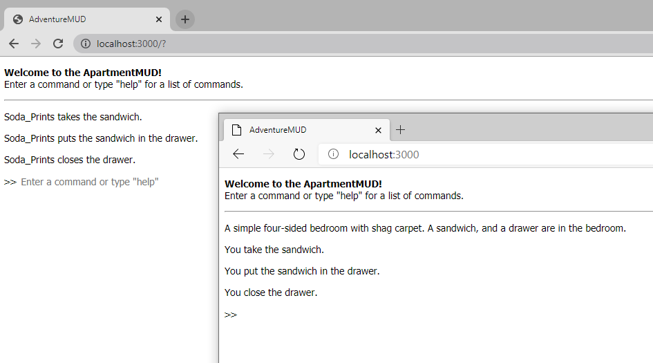

# ApartmentMUD

UPDATE: testing server is LIVE! Checkout the latest functionality here: http://159.65.79.105:3000/

Successor to AdventureRoom, this will add multiplayer support by moving all game data to MongoDB, and provide client access via socket.io

Example of current capabilities below. Multiple users is now supported on a local network, with personalized messaging:

